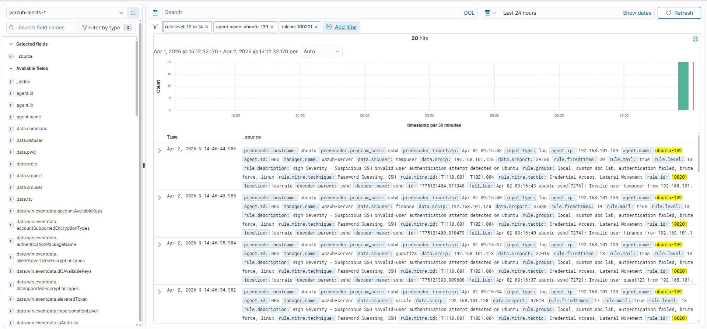
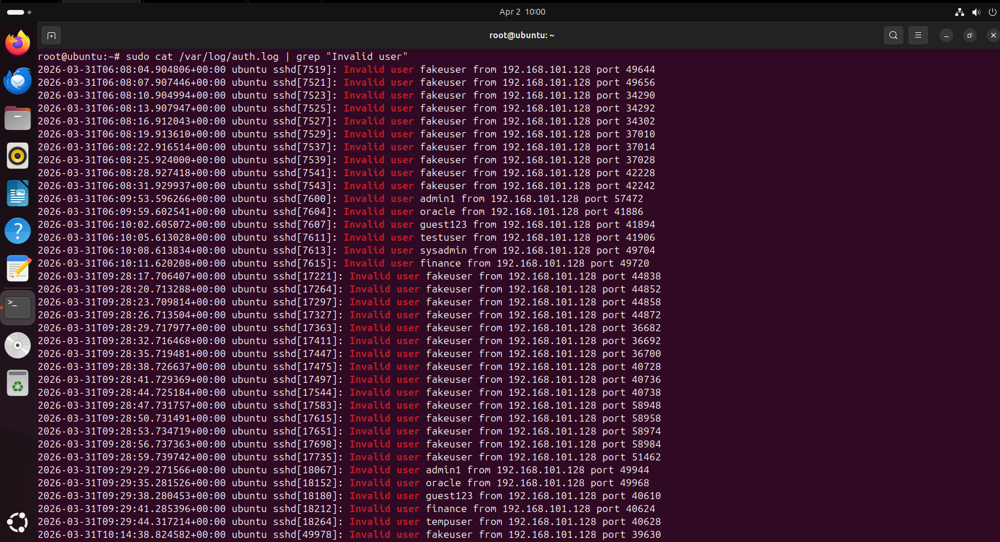

# Investigation 01 — Ubuntu SSH Invalid User Authentication Attempt

## Investigation Summary

This investigation documents a **high-severity SSH authentication alert** triggered on the Ubuntu endpoint after repeated login attempts using an **invalid username**.

The activity was designed to simulate **credential guessing / brute-force style reconnaissance** against SSH services and validate custom Wazuh detection logic.

---

## Alert Details

- **Detection Name:** SSH Invalid User Authentication Attempt
- **Rule ID:** `100201`
- **Severity:** High
- **Endpoint:** `ubuntu`
- **Operating System:** Ubuntu 24.04.4 LTS
- **Relevant ATT&CK Techniques:**
  - `T1110.001` — Password Guessing
  - `T1021.004` — SSH

---

## Alert Snapshot

---

## Supporting Evidence

---

## Analyst Notes

The alert was triggered after SSH login attempts were made against the Ubuntu system using an **invalid account name**.

The supporting authentication log evidence confirms:
- failed SSH login activity
- use of an invalid username
- attacker-originated authentication attempts against the Ubuntu host

This behavior is consistent with **early-stage access attempts**, where an attacker probes for valid usernames or attempts low-volume brute-force access.

---

## Detection Logic Purpose

This custom rule was designed to identify:
- invalid SSH user attempts
- suspicious authentication failures
- potential reconnaissance or brute-force behavior targeting Linux systems

The detection helps improve visibility into **unauthorized remote access attempts** against exposed or monitored Linux services.

---

## Triage Assessment

### Initial Assessment
Suspicious authentication activity requiring investigation.

### Likely Intent
Username discovery or SSH access attempt.

### Risk Consideration
If repeated or combined with successful logins, this activity may indicate:
- brute-force escalation
- credential access attempts
- unauthorized remote access behavior

---

## Outcome

This alert was determined to be **expected malicious simulation activity** generated in the lab to validate detection coverage and analyst investigation workflow.

No actual compromise occurred.

---

## Investigation Value

This scenario demonstrates practical ability to:
- analyze Linux authentication alerts
- validate SIEM detections
- interpret auth log evidence
- document SSH-related suspicious activity in a SOC-style format
