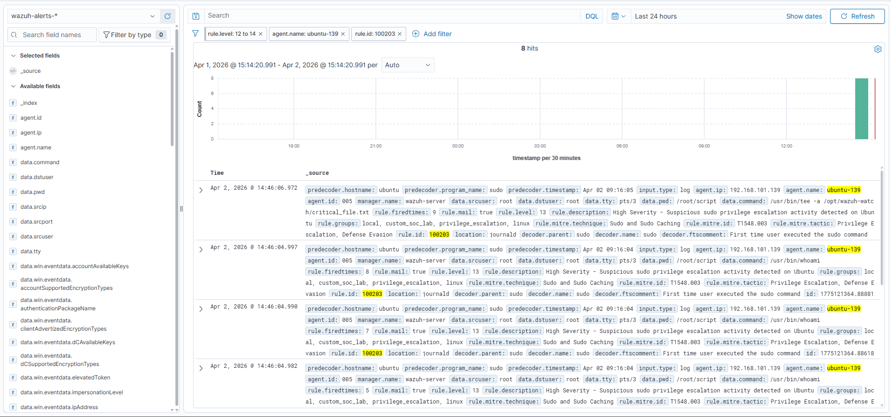
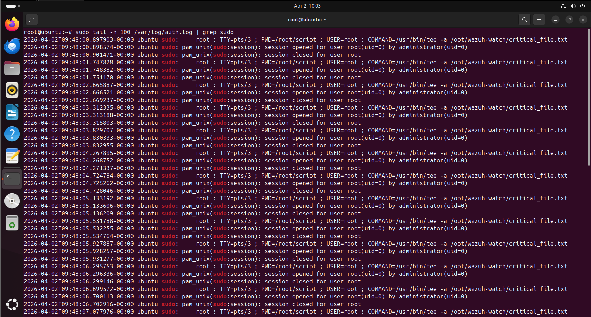

# Investigation 02 — Ubuntu Suspicious Sudo Privilege Escalation

## Investigation Summary

This investigation documents a **high-severity privilege escalation alert** triggered on the Ubuntu endpoint after suspicious use of `sudo`.

The objective of this scenario was to validate detection logic for **potential privilege escalation behavior** on Linux systems.

---

## Alert Details

- **Detection Name:** Suspicious Sudo Privilege Escalation
- **Rule ID:** `100203`
- **Severity:** High
- **Endpoint:** `ubuntu`
- **Operating System:** Ubuntu 24.04.4 LTS
- **Relevant ATT&CK Technique:**
  - `T1548.003` — Sudo and Sudo Caching

---

## Alert Snapshot

---

## Supporting Evidence

---

## Analyst Notes

The alert was triggered after elevated command execution activity was performed using `sudo` on the Ubuntu endpoint.

The supporting log evidence confirms:
- invocation of `sudo`
- elevated command execution context
- activity consistent with privilege escalation behavior

This type of event is important because `sudo` is frequently abused during:
- post-compromise escalation
- administrative abuse
- attacker privilege expansion after initial access

---

## Detection Logic Purpose

This custom rule was created to improve visibility into:
- suspicious privilege escalation attempts
- Linux administrative command abuse
- potentially attacker-driven use of `sudo`

The rule helps surface Linux events that may otherwise blend into normal administrative activity.

---

## Triage Assessment

### Initial Assessment
Potential privilege escalation event requiring analyst review.

### Likely Intent
Elevated command execution or privilege expansion.

### Risk Consideration
If associated with suspicious parent activity, unknown users, or unusual command usage, this type of alert may indicate:
- attacker privilege escalation
- abuse of elevated shell access
- misuse of local administrative permissions

---

## Outcome

This alert was determined to be **expected simulated activity** generated during controlled testing to validate custom Wazuh detection logic.

No unauthorized privilege escalation occurred outside the lab scenario.

---

## Investigation Value

This scenario demonstrates practical ability to:
- investigate Linux privilege escalation events
- validate custom SIEM detections
- analyze `sudo`-related telemetry
- document escalation behavior in a SOC-style workflow
