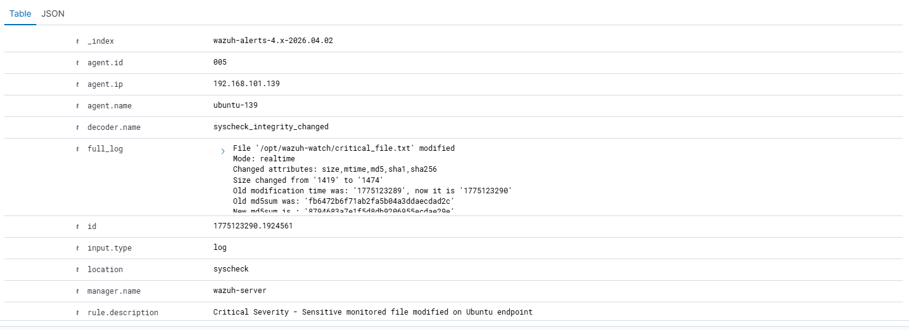

# Investigation 03 — Ubuntu Critical Sensitive File Modification

## Investigation Summary

This investigation documents a **critical-severity file integrity alert** triggered after modification of a monitored sensitive file on the Ubuntu endpoint.

The purpose of this scenario was to validate **file integrity monitoring (FIM)** coverage and identify suspicious file modification behavior relevant to Linux systems.

---

## Alert Details

- **Detection Name:** Critical Sensitive File Modification
- **Rule ID:** `100204`
- **Severity:** Critical
- **Endpoint:** `ubuntu`
- **Operating System:** Ubuntu 24.04.4 LTS
- **Relevant ATT&CK Technique:**
  - `T1565.001` — Stored Data Manipulation

---

## Alert Snapshot

---

## Supporting Evidence

---

## Analyst Notes

The alert was triggered after a monitored sensitive file was modified on the Ubuntu endpoint.

The supporting evidence confirms:
- file modification activity occurred
- the monitored file path matched the custom detection criteria
- the event was captured through Wazuh file integrity monitoring logic

Unauthorized or unexpected modification of sensitive files can indicate:
- attacker tampering
- persistence preparation
- unauthorized changes to monitored system content

---

## Detection Logic Purpose

This custom rule was created to identify:
- changes to monitored sensitive files
- high-risk Linux file modification activity
- integrity-impacting actions that warrant immediate analyst review

This improves visibility into suspicious changes that may otherwise go unnoticed during normal system activity.

---

## Triage Assessment

### Initial Assessment
High-priority integrity event requiring immediate review.

### Likely Intent
File tampering, unauthorized modification, or test simulation activity.

### Risk Consideration
Depending on file sensitivity, this type of event could indicate:
- attacker persistence preparation
- system tampering
- operational or configuration integrity impact

---

## Outcome

This alert was determined to be **expected simulated lab activity** generated to validate file integrity monitoring and detection engineering coverage.

No real malicious persistence or unauthorized tampering remained on the endpoint.

---

## Investigation Value

This scenario demonstrates practical ability to:
- investigate Linux file integrity alerts
- validate FIM-based detections
- analyze suspicious file change activity
- document high-severity integrity events in a SOC-style format
