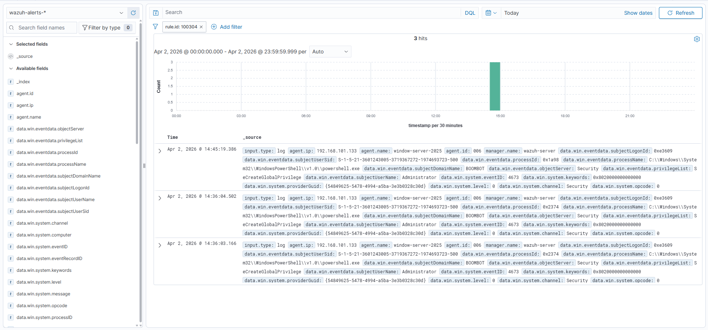

# Investigation 04 — Windows Suspicious PowerShell Execution

## Investigation Summary

This investigation documents a **high-severity PowerShell execution alert** triggered on the Windows endpoint and captured through Sysmon telemetry forwarded into Wazuh.

The purpose of this scenario was to validate detection logic for **potential attacker-like PowerShell execution behavior** commonly seen in Windows intrusion activity.

---

## Alert Details

- **Detection Name:** Suspicious PowerShell Execution
- **Rule ID:** `100304`
- **Severity:** High
- **Endpoint:** `WS-25`
- **Operating System:** Windows Server 2025 Datacenter Evaluation
- **Relevant ATT&CK Technique:**
  - `T1059.001` — PowerShell

---

## Alert Snapshot

---

## Supporting Evidence

---

## Analyst Notes

The alert was triggered after PowerShell execution activity was observed on the Windows endpoint and captured via Sysmon process telemetry.

The supporting evidence confirms:
- execution of `powershell.exe`
- process-level visibility through Sysmon
- activity aligned with suspicious script or command execution monitoring

PowerShell is frequently abused by attackers for:
- execution
- discovery
- payload staging
- lateral movement support
- defense evasion

Because of that, even relatively simple PowerShell execution can warrant analyst review depending on context.

---

## Detection Logic Purpose

This custom rule was designed to improve detection coverage for:
- suspicious PowerShell usage
- attacker-like script execution
- Windows process activity commonly associated with post-exploitation behavior

The rule helps convert Sysmon process telemetry into actionable SIEM alerting for SOC investigation workflows.

---

## Triage Assessment

### Initial Assessment
Suspicious Windows execution activity requiring analyst review.

### Likely Intent
Command execution, script execution, or attacker simulation behavior.

### Risk Consideration
If paired with encoded commands, remote execution, unusual parent processes, or administrative abuse, this type of alert may indicate:
- malicious script execution
- post-compromise activity
- attacker tooling usage

---

## Outcome

This alert was determined to be **expected simulated lab activity** generated to validate PowerShell detection logic and Windows-focused investigation workflow.

No real malicious compromise occurred on the system.

---

## Investigation Value

This scenario demonstrates practical ability to:
- investigate Windows PowerShell alerts
- analyze Sysmon process telemetry
- validate custom SIEM detections
- document suspicious execution behavior in a SOC-style format
