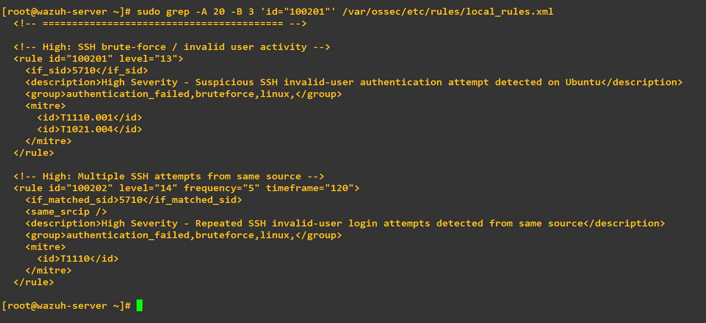
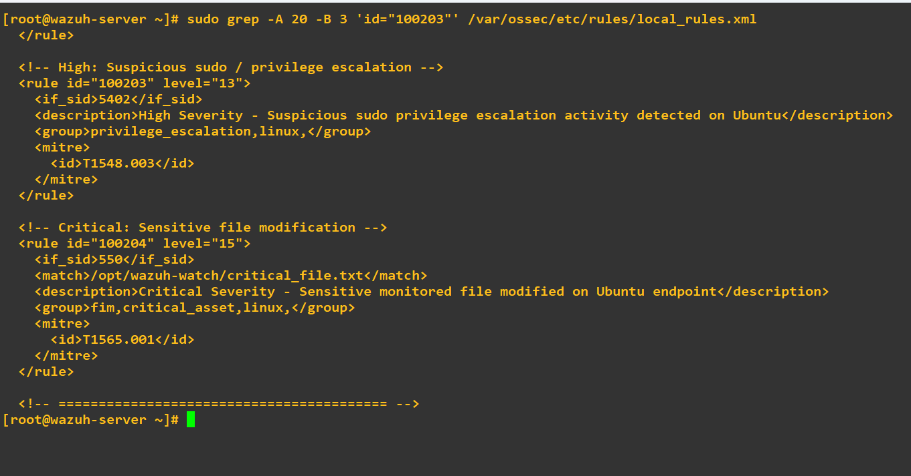
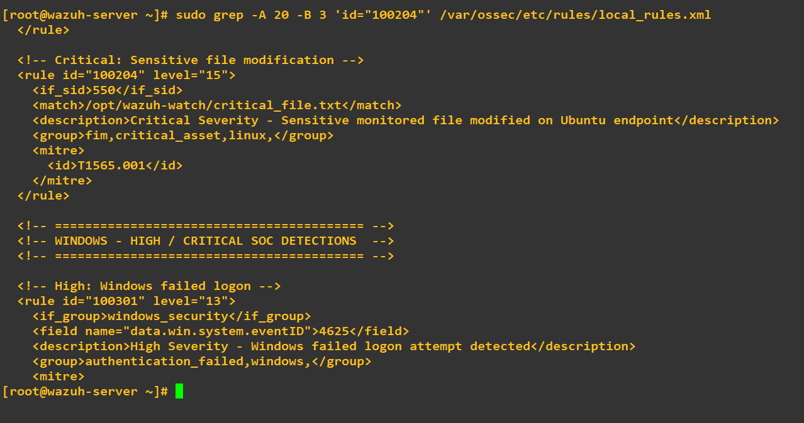
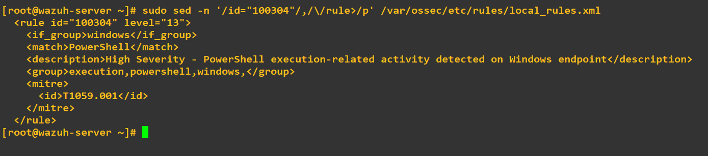

# Custom Rule Notes

## Overview

This file documents the custom Wazuh rules created for this lab to detect suspicious or attacker-like activity across **Linux and Windows systems**.

These rules were built to improve visibility into:

- SSH authentication abuse
- Linux privilege escalation behavior
- sensitive file modification
- suspicious PowerShell execution

Each rule was tested in the lab and mapped to relevant **MITRE ATT&CK techniques** where applicable.

---

## Rule Development Goals

The custom rules in this project were created to support the following Blue Team objectives:

- detect suspicious activity with meaningful alert context
- improve visibility into Linux and Windows security events
- simulate realistic SOC alerting workflows
- validate detections using lab-generated attack activity
- document investigation-ready alerts for analyst review

The goal was not only to generate alerts, but to ensure the alerts were **practical, explainable, and useful for triage**.

---

## Custom Rules Included

### Rule IDs Implemented

| Rule ID | Detection Name | Platform | Severity |
|--------|----------------|----------|----------|
| `100201` | SSH Invalid User Authentication Attempt | Ubuntu | High |
| `100203` | Suspicious Sudo Privilege Escalation | Ubuntu | High |
| `100204` | Critical Sensitive File Modification | Ubuntu | Critical |
| `100304` | Suspicious PowerShell Execution | Windows | High |

---

## Rule 100201 — SSH Invalid User Authentication Attempt

### Purpose

This rule was created to detect SSH authentication attempts using **invalid usernames** on the Ubuntu endpoint.

This type of behavior can indicate:
- username enumeration
- brute-force style access attempts
- unauthorized remote access probing

### Detection Focus

The rule improves visibility into Linux authentication activity that may otherwise be buried in normal login noise.

### MITRE ATT&CK Mapping

- `T1110.001` — Password Guessing
- `T1021.004` — SSH

### Rule Screenshot

---

## Rule 100203 — Suspicious Sudo Privilege Escalation

### Purpose

This rule was created to detect suspicious `sudo` execution activity on the Ubuntu endpoint.

This helps surface Linux events associated with:
- privilege escalation attempts
- elevated command execution
- potential attacker abuse of local administrative access

### Detection Focus

The rule highlights potentially sensitive escalation behavior that can be important during:
- post-compromise investigation
- Linux host triage
- insider or misuse review

### MITRE ATT&CK Mapping

- `T1548.003` — Sudo and Sudo Caching

### Rule Screenshot

---

## Rule 100204 — Critical Sensitive File Modification

### Purpose

This rule was created to detect modification of a monitored sensitive file on the Ubuntu endpoint.

This type of activity may indicate:
- file tampering
- unauthorized system changes
- persistence preparation
- integrity-impacting behavior

### Detection Focus

The rule was designed to support **file integrity monitoring (FIM)** and provide immediate visibility into changes affecting monitored assets.

### MITRE ATT&CK Mapping

- `T1565.001` — Stored Data Manipulation

### Rule Screenshot

---

## Rule 100304 — Suspicious PowerShell Execution

### Purpose

This rule was created to detect PowerShell execution-related activity on the Windows endpoint using telemetry forwarded into Wazuh.

PowerShell is frequently used during:
- attacker execution
- script-based activity
- discovery
- post-exploitation behavior

### Detection Focus

The rule helps convert Windows execution telemetry into analyst-actionable alerts that can support:
- process review
- command-line investigation
- suspicious script activity triage

### MITRE ATT&CK Mapping

- `T1059.001` — PowerShell

### Rule Screenshot

---

## Detection Engineering Notes

A key focus of this project was building detections that were:

- understandable
- explainable
- testable
- relevant to SOC investigation workflows

Instead of creating overly complex logic, the goal was to create alerts that could realistically support:

- triage
- escalation decisions
- evidence review
- analyst interpretation

This approach keeps the project practical and aligned with real-world defensive workflows.

---

## Validation Approach

Each rule was validated through controlled activity in the lab environment.

Validation included:
- generating the triggering behavior
- confirming Wazuh alert creation
- reviewing event evidence
- documenting the investigation path
- mapping alerts to ATT&CK where appropriate

This ensured the detections were not just written, but **actually tested and usable**.

---

## Why This Matters

Custom rule development is one of the most valuable parts of this lab because it demonstrates the ability to:

- turn raw telemetry into detections
- improve SIEM visibility
- build practical security monitoring logic
- document detection behavior clearly
- support investigation-ready alerting

This is a core skill set for **SOC, Blue Team, and junior detection engineering roles**.
